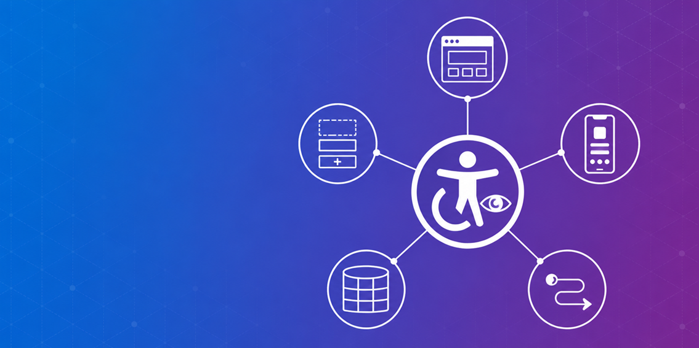

# Power Platform Accessibility Documentation

A curated, community-driven knowledge base of accessibility (WCAG 2.1/2.2, EN 301 549, Section 508) guidance for the Microsoft Power Platform—covering Power Pages, PCF components, Canvas Apps, Model-Driven Apps, and Power Automate—built for architects and developers shipping compliant enterprise solutions.

## Introduction

Power Platform makes it easy to build apps and sites quickly, but accessibility compliance (WCAG, Section 508, EN 301 549) is often an afterthought until an audit or a real user hits a barrier. This repo collects practical, source-linked accessibility guidance per product area so architects and developers can design and build compliant solutions from the start, rather than retrofitting them later.

## Documentation

The published documentation site is available at **[aidevme.github.io/powerplatform-accessibility-docs](https://aidevme.github.io/powerplatform-accessibility-docs/)**.

Guidance is organized by product area under [`docs/`](docs). **Start with the [documentation overview](docs/index.md)**—it compares accessibility conformance, tooling, and effort across surfaces, with separate reading paths for Solution Architects and developers.

- [Power Pages](docs/power-pages)
- [Power Apps—Canvas apps](docs/canvas-apps)
- [Power Apps—Code Apps](docs/code-apps)
- [Power Apps Component Framework (PCF)](docs/powerapps-component-framework)
- [Power Apps—Generative pages](docs/generative-pages)
- [Power Apps—MCP App widgets](docs/mcp-apps)
- [Power Apps—Model-driven apps](docs/model-apps)
- [Power Apps—Mobile client](docs/mobile-apps)
- [Fluent UI React (v9)](docs/fluent-ui-react)—shared reference for the component library used by PCF and Code Apps

See [Contributing](#contributing) if you'd like to help add a new product area or improve an existing page.

## Discussions

Have a question, or guidance that doesn't fit an issue template? Use [GitHub Discussions](https://github.com/aidevme/powerplatform-accessibility-docs/discussions) instead of opening an issue.

## Contributing

Contributions are welcome—fixing inaccuracies, adding new pages, updating stale content, or fixing broken links. See [CONTRIBUTING.md](CONTRIBUTING.md) for scope, documentation conventions, and how to submit changes.

## License

This project is licensed under the [MIT License](LICENSE).
